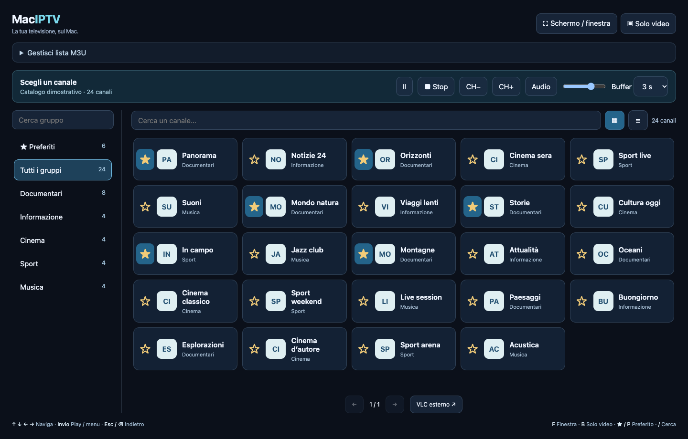
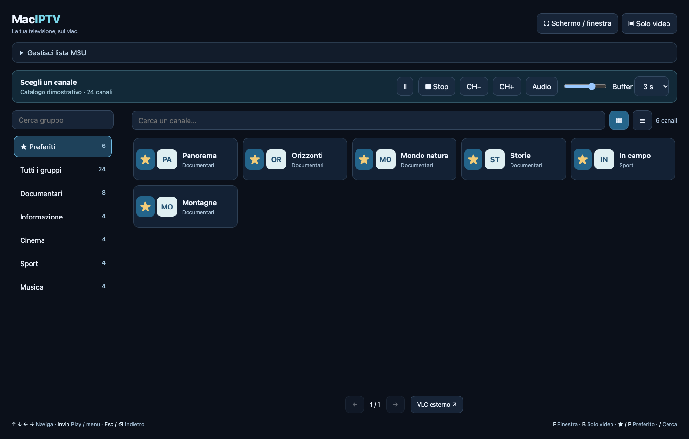
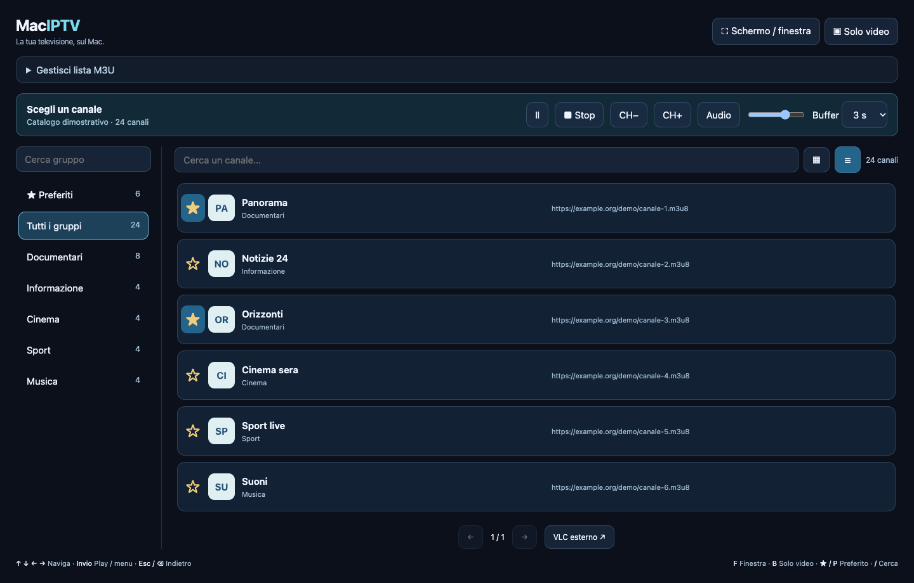
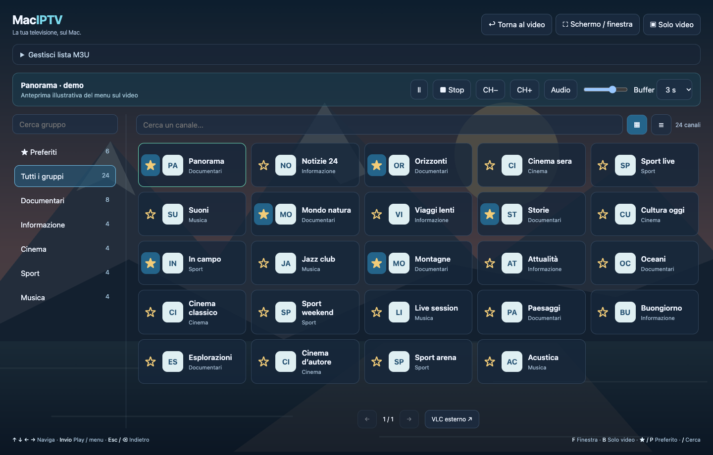

# MacIPTV

**Liste M3U, canali e preferiti. La tua IPTV sul Mac, con il player già incluso.**

[Scarica per Intel e Apple Silicon](https://github.com/spacecdr/MacIPTV/releases/latest) · [Pagina del progetto](https://spacecdr.github.io/MacIPTV/) · [Comandi](#comandi) · [Compilazione e test](DEVELOPMENT.md)

*Interfaccia reale del catalogo, renderizzata con canali dimostrativi. Nessuna playlist o credenziale è inclusa.*

MacIPTV è un’applicazione standalone per macOS: carichi una lista M3U da file o URL, scegli il canale e lo guardi direttamente sul Mac. Parte a schermo intero, si usa anche da tastiera e può diventare una piccola finestra video senza bordi, sempre in primo piano.

## Download e installazione

1. Scarica **MacIPTV-universal.zip** dalla [release](https://github.com/spacecdr/MacIPTV/releases/latest).
2. Estrai lo ZIP e trascina **MacIPTV.app** in **Applicazioni**.
3. Apri l’app e usa **Gestisci lista M3U** per caricare un file o incollare un URL.

L’archivio contiene entrambe le architetture: **Intel x86_64 e Apple Silicon arm64**. Non occorre installare VLC, Python, Homebrew o un browser. Il player utilizza il motore VLC incorporato.

La versione 1.0.0 ha una firma locale ad hoc e **non è notarizzata Apple**. Se macOS ne impedisce l’apertura, dopo il primo tentativo verifica **Impostazioni di Sistema → Privacy e sicurezza → Apri comunque**. Non occorre disattivare Gatekeeper. I checksum della release permettono di verificare l’integrità del download.

## Funzionalità

| Funzione | Cosa puoi fare |
| --- | --- |
| Liste M3U | Importare file e URL HTTP/HTTPS, aggiornare le liste remote ed esportare la lista salvata |
| Gruppi e ricerca | Cercare gruppi e canali, vedere i conteggi e consultare pagine da 60 canali |
| Griglia o elenco | Cambiare vista; nell’elenco puoi selezionare e copiare il link del canale |
| Preferiti | Aggiungere o rimuovere un canale con la stella; ritrovarlo ai prossimi avvii |
| Player integrato | Riprodurre con LibVLC, regolare volume, pausa, muto e buffer da 1 a 10 secondi |
| Menu sul video | Premere Invio per riaprire il catalogo semitrasparente, conservando filtri e selezione |
| Fullscreen e finestra | Passare da schermo intero a finestra con F |
| Solo video | Premere B per una finestra senza bordi, ridimensionabile e sempre in primo piano |
| Cambio canale | Usare CH+/CH− all’interno del gruppo, della ricerca o dei preferiti correnti |
| VLC esterno | Aprire il canale selezionato in un’installazione separata di VLC, se disponibile |

### I canali che vuoi ritrovare

La stella è separata dal pulsante di riproduzione. I preferiti vengono salvati sul Mac e possono essere filtrati con la ricerca.

### Link visibili, elenco compatto

La vista elenco affianca nome, gruppo e URL. Gli indirizzi lunghi scorrono nella propria area senza allargare la finestra.

### Il catalogo resta sopra il video

*Anteprima illustrativa: l’interfaccia reale è mostrata su uno sfondo grafico dimostrativo, non su una trasmissione TV.*

Durante la riproduzione, **Invio** riapre lo stesso catalogo senza fermare il player. Seleziona un altro canale oppure torna al video. **B** attiva la finestra flottante; trascina il video per spostarla e l’angolo inferiore destro per ridimensionarla. Premendo di nuovo B ripristini la finestra precedente.

## Comandi

| Tasto | Nel catalogo | Durante il video |
| --- | --- | --- |
| ↑ ↓ ← → | Navigazione; → dai gruppi entra nei canali | ↑/↓ cambia canale; ←/→ regola il volume |
| Invio | Attiva il controllo o riproduce il canale | Riapre il menu semitrasparente |
| Esc / Backspace | Dai canali torna ai gruppi, poi al video | Riapre il catalogo |
| F | Schermo intero / finestra | Schermo intero / finestra |
| B | Modalità solo video | Modalità solo video |
| Spazio | Pausa / riprendi | Pausa / riprendi |
| M | Audio / muto | Audio / muto |
| S | Stop | Stop |
| P | Preferito del canale selezionato | — |
| / | Cerca un canale | — |
| Cmd+O | Apri lista | Apri lista |
| Cmd+L | Catalogo | Catalogo |
| Cmd+Q | Esci | Esci |

Nei campi di testo, frecce e Backspace mantengono il normale comportamento di modifica; Esc torna alla navigazione. Tab e Shift+Tab raggiungono gli altri controlli. Nella modalità senza bordi, doppio clic sul video riapre il catalogo.

## Requisiti

- **macOS 13 Ventura o successivo**, su Mac Intel o Apple Silicon.
- Una lista M3U con canali accessibili e formati supportati da VLC.
- Connessione al server della lista e dei canali. La lista può essere un file locale.
- VLC installato separatamente **solo** se vuoi usare il player esterno.

Limite della lista: **20 MB**. Un’importazione invalida conserva la lista precedente. Le liste importate da file vanno ricaricate per aggiornarle. Il comportamento di un canale dipende dal provider; non sono inclusi canali, abbonamenti, EPG, registrazione o supporto DRM.

**Stato delle verifiche:** riproduzione nativa e transizioni finestra/fullscreen/flottante provate su Apple Silicon. La build e i componenti necessari contengono le architetture Intel e ARM; la prova su un Mac Intel fisico resta da effettuare. Il livello flottante è soggetto alle finestre riservate di macOS. Usando VLC esterno, finestra e comandi sono gestiti da VLC.

## Tecnologie

| Componente | Tecnologia |
| --- | --- |
| Applicazione e finestre | Swift, AppKit / Cocoa |
| Catalogo e menu | WKWebView locale, HTML, CSS e JavaScript |
| Video e audio | LibVLC 3.0.24 con runtime e codec incorporati |
| Importazione remota | Foundation URLSession |
| Dati locali | JSON, scrittura atomica, permessi privati |
| Identificatori dei canali | SHA-256 con CryptoKit |
| Build Universal | swiftc, lipo e codesign |
| Sito del progetto | HTML/CSS statici su GitHub Pages |

L’app non avvia un server web e non richiede servizi cloud propri. La WKWebView è integrata in macOS: l’interfaccia non dipende da Chrome o Safari installati come applicazioni separate.

## Dati locali

Lista e preferiti sono in `~/Library/Application Support/IPTVMac/`. Gli URL possono contenere credenziali: non condividere i file salvati o screenshot con indirizzi personali. La navigazione usa i server indicati dalla lista per playlist, stream e loghi. I metadati sono trattati come testo, non come codice HTML.

## Sviluppo e licenze

Consulta [DEVELOPMENT.md](DEVELOPMENT.md) per build, test e struttura del progetto. Il codice dell’app è distribuito con licenza **GPL-3.0-or-later**. VLC e le sue dipendenze conservano le rispettive licenze: dettagli, sorgenti e riferimenti in [THIRD_PARTY.md](THIRD_PARTY.md).
