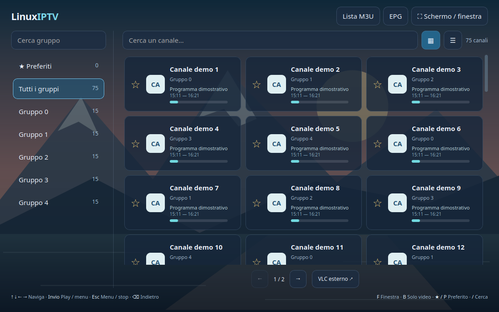
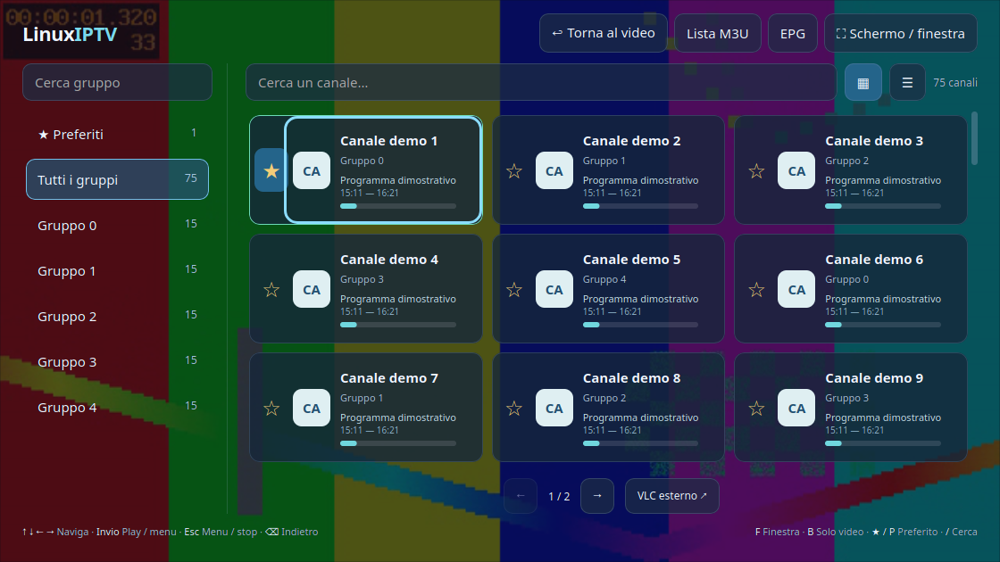

# LinuxIPTV

**Liste M3U, canali e preferiti. La tua IPTV su Linux, con player integrato.**

Port Linux di [MacIPTV](https://github.com/spacecdr/MacIPTV) 1.2.0: riutilizza i file originali del catalogo e delle info, mantenendo layout, gruppi, ricerca, griglia/elenco, preferiti, guida EPG e navigazione da tastiera. Il contenitore macOS è sostituito da GTK 3, WebKitGTK e LibVLC.



*Interfaccia reale su Linux, con catalogo e guida sintetici.*

Non sono incluse playlist, credenziali, abbonamenti o canali. Importa un file M3U/M3U8 o il tuo URL HTTP/HTTPS.

## Installazione Ubuntu / Debian

Scarica il pacchetto `.deb` dalla [release Linux](https://github.com/spacecdr/LinuxIPTV/releases/latest), quindi:

```sh
sudo apt install ./linuxiptv_1.2.0+linux1_all.deb
```

Apri **LinuxIPTV** dal menu applicazioni. `apt` installa anche le dipendenze: il player è dentro la finestra dell’app e usa LibVLC del sistema. Il pacchetto non incorpora una copia dei codec.

Verificato su **Ubuntu 24.04 x86_64**, in sessione Wayland tramite XWayland. Sono necessari Python 3.10+, GTK 3, WebKitGTK 4.1 e LibVLC 3. Per altre distribuzioni installa gli equivalenti dei pacchetti qui sotto; non sono ancora state testate su hardware reale.

## Avvio dai sorgenti

```sh
git clone https://github.com/spacecdr/LinuxIPTV.git
cd LinuxIPTV
sudo apt install python3-gi python3-gi-cairo gir1.2-gtk-3.0 gir1.2-webkit2-4.1 libvlc5 vlc-plugin-base vlc-plugin-video-output xwayland
./linuxiptv
```

Per installare una copia nell’account corrente, con icona nel menu e comando in `~/.local/bin`:

```sh
python3 Linux/install.py
```

Non servono pip, un browser esterno o un server web. L’installazione da sorgenti usa i componenti della distribuzione. Per disinstallare il pacchetto: `sudo apt remove linuxiptv`. La disinstallazione conserva le playlist personali.

## Funzioni e comandi

- Playlist multiple da file e URL; aggiornamento, modifica, rimozione ed esportazione. Gli errori di importazione conservano la lista precedente. Limite M3U: 20 MB.
- Gruppi, ricerca, pagine da 60 canali, griglia/elenco e preferiti separati per lista; filtri e selezione ricordati.
- EPG XMLTV e gzip: sorgenti dalla playlist o URL manuale, aggiornamento in background, cache, associazione per ID/nome con controllo delle ambiguità e diagnostica.
- Riproduzione integrata, pausa, volume, muto, buffer, cambio canale nei filtri correnti e apertura opzionale in VLC esterno.
- Catalogo trasparente sopra il video, info con programma attuale/successivo e telecomando. Il mouse sul box info sospende la chiusura automatica.
- Fullscreen, finestra e modalità senza bordi sempre in primo piano; trascinamento e ridimensionamento dall’angolo inferiore destro.

| Tasto | Azione |
| --- | --- |
| Frecce nel catalogo | Naviga tra gruppi e canali |
| Invio | Riproduce / riapre il catalogo |
| Esc | Chiude prima le info o un dialogo; nel video apre il catalogo, un altro Esc ferma |
| Backspace | Torna ai gruppi, poi al video; durante il video apre il catalogo |
| F | Fullscreen / finestra |
| B | Solo video senza bordi / modalità precedente |
| I | Info e telecomando |
| Spazio, M, S | Pausa, muto, stop |
| ↑ / ↓ nel video | Canale successivo / precedente |
| ← / → nel video | Volume |
| P, / | Preferito / cerca nel catalogo |
| Ctrl+O, Ctrl+L, Ctrl+Q | Apri lista, catalogo, esci |

Il primo avvio è a schermo intero; in seguito viene ripristinata la modalità della sessione. `./linuxiptv --windowed` forza la finestra. `--playlist /percorso/lista.m3u` importa un file all’avvio.



*Menu reale sopra un video di test generato, non una trasmissione TV.*

## Dati locali

I dati sono salvati in `${XDG_DATA_HOME:-~/.local/share}/linuxiptv-data/`, separati dall’installazione e dall’app Mac. Directory con permessi `0700`, file privati con permessi `0600`, salvataggio atomico. `--data-dir /percorso` permette un archivio distinto.

Per trasferire una lista dal Mac, esportala da MacIPTV e apri il file in LinuxIPTV, oppure inserisci lo stesso URL. Le copie salvate da MacIPTV si trovano in `~/Library/Application Support/IPTVMac/`; non fanno parte del repository. Non pubblicare file contenenti URL personali.

## Stato delle verifiche

Test automatici su parser/persistenza/EPG, test del catalogo originale nel browser con 6.442 canali e test nativo GTK/LibVLC con video sintetico: riproduzione da file e HTTP locale, avanzamento video, frame decodificati, menu sovrapposto, telecomando, fullscreen, borderless, ritorno, stop e regressione fullscreen. Le immagini di prova usano soltanto dati sintetici.

La verifica nativa non certifica l’audio ascoltato, ogni provider IPTV, le prestazioni 4K o tutte le combinazioni di driver/window manager. Il port usa la composizione dei frame LibVLC in GTK per mantenere gli overlay trasparenti; l’utilizzo CPU può differire dalla versione Mac. Il comportamento “sempre in primo piano” dipende dal gestore finestre. Non è previsto supporto DRM.

Build, test e architettura: [DEVELOPMENT.md](DEVELOPMENT.md). Documentazione storica Mac: [docs/MacIPTV.md](docs/MacIPTV.md).

Licenza **GPL-3.0-or-later**. Il repository conserva la cronologia di MacIPTV; il port Linux non modifica il repository originale. Dipendenze e licenze: [THIRD_PARTY.md](THIRD_PARTY.md).
